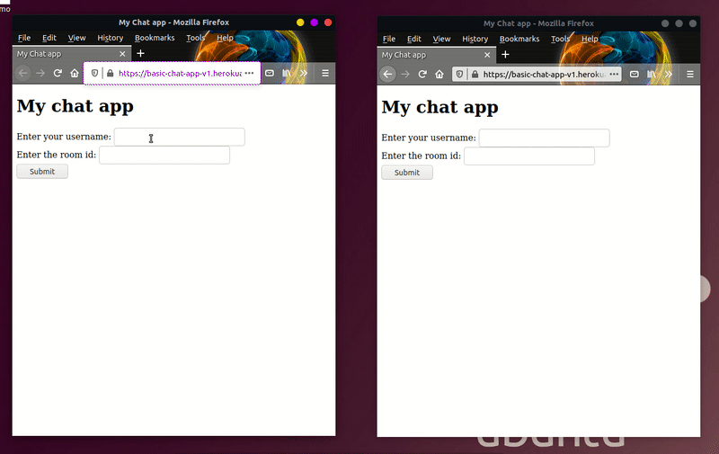
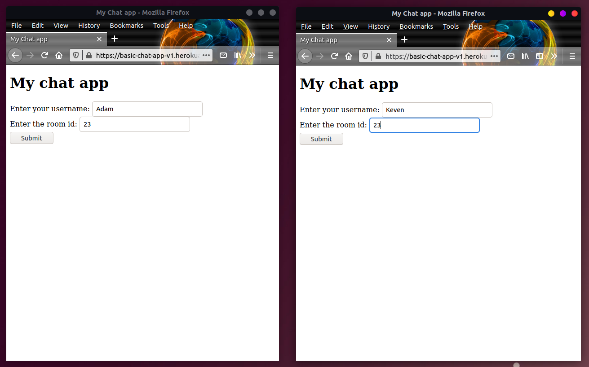
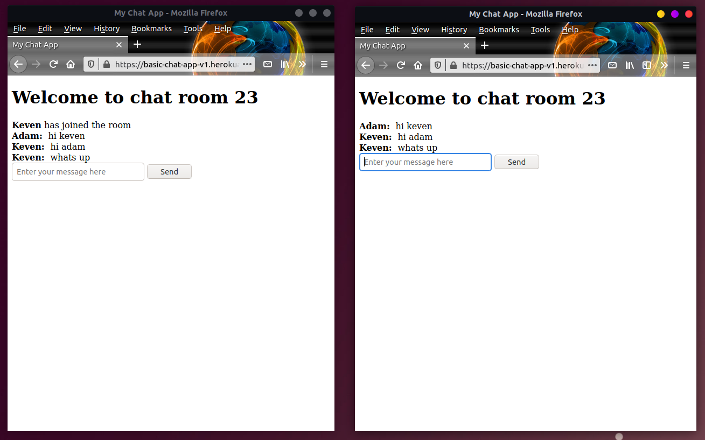

# flask-chat-app-v1
# Building a Basic Chat Application using Flask and Socket.IO
<br>

## Screenshots




### Entering name and room id



### Chatting with friends




## Socket.IO vs WebSocket

```
WebSocket is the communication Protocol which provides bidirectional communication between the Client and the Server over a TCP connection, WebSocket remains open all the time so they allow the real-time data transfer. When clients trigger the request to the Server it does not close the connection on receiving the response, it rather persists and waits for Client or server to terminate the request.
```

<br>

```
Socket.IO is a library which enables real-time and full duplex communication between the Client and the Web servers. It uses the WebSocket protocol to provide the interface. Generally, it is divided into two parts, both WebSocket vs Socket.io are event-driven libraries
```

<br>

## Why do we need Socket.IO

- It handle all the degradation of your technical alternatives to get full duplex communication in real time.
- It also handles the various support level and the inconsistencies from the browser.
- It also gives the additional feature room support for basic publish infrastructure and thinks like automatic reconnect.
- It supports broadcasting and fallback options

<br>


>Socket.IO is a [transport protocol](https://github.com/socketio/socket.io-protocol) that enables real-time bidirectional event-based communication between clients (typically, though not always, web browsers) and a server. The official implementations of the client and server components are written in **JavaScript**

>Flask is a micro web framework written in Python. It is classified as a microframework because it does not require particular tools or libraries. It has no database abstraction layer, form validation, or any other components where pre-existing third-party libraries provide common functions.

>Socket.IO integration for Flask applications. It is built over [python-socketio](https://python-socketio.readthedocs.io/en/latest/) which provides Python implementations of a Socket.IO client and server.

<br>

[eventlet](http://eventlet.net/)
>Eventlet is a concurrent networking library for Python that allows you to change how you run your code, not how you write it.


## Part1:

- ## Setting up the virtual environment

        $ python3 -m venv venv

- ## Activating the virtual environment

        $ source venv/bin/activate

- ## Now we have to install the flask inside the venv

        (venv) $ pip install flask

- ## Checking the packages installed using
        (venv) $ pip freeze
        click==7.1.2
        Flask==1.1.2
        itsdangerous==1.1.0
        Jinja2==2.11.3
        MarkupSafe==1.1.1
        Werkzeug==1.0.1


<br>
<br>

The very first basic structure of flask app

```python
from flask import Flask

app = Flask(__name__)


@app.route('/')
def index():
    return 'Hello World'


if __name__== '__main__':
    app.run(debug = True)
```


## install the flask socketio using pip
    
    pip install flask-socketio

## **Note**

<br>

| JavaScript Socket.IO version | Socket.IO protocol revision | Engine.IO protocol revision | Flask-SocketIO version | python-socketio version | python-engineio version |
|------------------------------|-----------------------------|-----------------------------|------------------------|-------------------------|-------------------------|
| 0.9.x                        | 1,2                         | 1,2                         | Not supported          | Not supported           | Not supported           |
| 1.x and 2.x                  | 3,4                         | 3                           | 4.x                    | 4.x                     | 3.x                     |
| 3.x                          | 5                           | 4                           | 5.x                    | 5.x                     | 4.x                     |

<br>

I have installed Flask-SocketIO version 5, so you need version 3 of the JavaScript client, from the above table

I will use this CDN URL  version 3.0.5: https://cdnjs.cloudflare.com/ajax/libs/socket.io/3.0.5/socket.io.min.js 


```html
<script src="https://cdnjs.cloudflare.com/ajax/libs/socket.io/3.0.5/socket.io.min.js"></script>
<script type="text/javascript" charset="utf-8">
        var socket = io.connect("http://127.0.0.1:5000");

        socket.on('connect', function () {
            socket.emit("join_room", {
                username: "{{ username }}",
                room: "{{ room }}"
            })

        })
</script>
```

<br>

# Part 2

Now lets create a folder named **templates**

## templates
- index.html
- chat.html

>## Here in the below codes NO:XX is given for understanding internal workings
<br>

## index.html
```html
<!DOCTYPE html>
<html lang="en">

<head>
    <meta charset="UTF-8">
    <meta name="viewport" content="width=device-width, initial-scale=1.0">
    <title>My Chat app</title>
</head>

<body>
    <h1>My chat app</h1>

    <!-- The action of the form is "/chat" which will do a GET request 
    in the chat @route when the submit button is clicked -->
    <form action="/chat">

        <div>
            <label>Enter your username:</label>
            <input type="text" name="username">
        </div>


        <div>
            <label>Enter the  room  id:</label>
            <input type="text" name="room">
        </div>

        <button type="submit">Submit</button>
    </form>
</body>

</html>
```

<br>
<br>

## chat.html
```html
<!DOCTYPE html>
<html lang="en">

<head>
    <meta charset="UTF-8">
    <meta name="viewport" content="width=device-width, initial-scale=1.0">
    <title>My Chat App</title>
</head>

<body>
    <h1>Welcome to chat room {{ room }}</h1>

    <!-- This div is given id for appending the incoming messages -->
    <div id="messages"></div>

    <!-- The form is also given an id for stoping its default behaviour-->
    <form id="message_input_form">
        <input type="text" id="message_input" placeholder="Enter your message here">
        <button type="submit">Send</button>
    </form>

</body>


<!-- NO:3 -->
<script src="https://cdnjs.cloudflare.com/ajax/libs/socket.io/3.0.5/socket.io.min.js"></script>

<script>
    //for getting the host and port of the server its running
    const host = document.location.host ;
    console.log(host)


    // const socket = io.connect("http://127.0.0.1:5000");
    // const socket = io.connect("http://localhost");
    // const socket = io.connect("http://192.168.43.151.5000");
    // const socket = io.connect(host);
    // var socket = io.connect('http://' + document.domain + ':' + location.port);
    
    // NO:3
    // here it will connect automatically with the server. The above examples can also be used.
    // after connecting it will call a join room event in the app.py file and sends data.
    var socket = io()


    socket.on('connect', function () {
        socket.emit('join_room', {
            username: "{{ username }}",
            room: "{{ room }}"
        });


        // NO:6
        // if someone writes something we will receive the message and call the send_message event.
        let message_input = document.getElementById('message_input');
        
        // for stopping the default function of the submit button and emmiting it in
        // the send_message event
        document.getElementById('message_input_form').onsubmit = function (e) {
            e.preventDefault();
            let message = message_input.value.trim();
            if (message.length) {
                socket.emit('send_message', {
                    username: "{{ username }}",
                    room: "{{ room }}",
                    message: message
                })
            }
            // reseting the input value
            message_input.value = '';
            message_input.focus();
        }
    });

    // NO:9
    // if the window is closed the leave_room event is called
    window.onbeforeunload = function () {
        socket.emit('leave_room', {
            username: "{{ username }}",
            room: "{{ room }}"
        })
    };


    //NO:5 
    socket.on('join_room_announcement', function (data) {
        console.log(data);
        if (data.username !== "{{ username }}") {

            // creating a new node and appending innerHTML in the 'messages' div
            const newNode = document.createElement('div');
            newNode.innerHTML = `<b>${data.username}</b> has joined the room`;
            document.getElementById('messages').appendChild(newNode);
        }
    });
    
    // NO:8
    socket.on('receive_message', function (data) {
        console.log(data);
        const newNode = document.createElement('div');
        newNode.innerHTML = `<b>${data.username}:&nbsp;</b> ${data.message}`;
        document.getElementById('messages').appendChild(newNode);
    });

    
    // NO:11
    socket.on('leave_room_announcement', function (data) {
        console.log(data);
        const newNode = document.createElement('div');
        newNode.innerHTML = `<b>${data.username}</b> has left the room`;
        document.getElementById('messages').appendChild(newNode);
    });
</script>

</html>
```

<br>
<br>


## app.py
```python
from flask import Flask, render_template, request, redirect, url_for
from flask_socketio import SocketIO, join_room, leave_room

app = Flask(__name__)
socketio = SocketIO(app)

# NO:1 
# first it will render the index.html template
@app.route('/')
def home():
    return render_template("index.html")

# NO:2
# It will get the form data from the index.html and pass it to chat.html
@app.route('/chat')
def chat():
    username = request.args.get('username')
    room = request.args.get('room')

    # if there is data then we wiil render chat.html and pass two arguments
    if username and room:
        return render_template('chat.html', username=username, room=room)
    else:
        return redirect(url_for('home'))

# NO:4
@socketio.on('join_room')
def handle_join_room_event(data):
    # here app.logger is used instead of print because it also prints the time of log.
    app.logger.info("{} has joined the room {}".format(data['username'], data['room']))
    # then it will create a room using the join_room function .
    # Then it will call a join_room_announcement event in chat.html and send data
    # and emit the join room announcement in the created room.
    join_room(data['room'])
    socketio.emit('join_room_announcement', data, room=data['room'])

# NO:7
@socketio.on('send_message')
def handle_send_message_event(data):
    app.logger.info("{} has sent message to the room {}: {}".format(data['username'],
                                                                    data['room'],
                                                                    data['message']))
    socketio.emit('receive_message', data, room=data['room'])


# NO:10
# if someone left the room then we will announce it
@socketio.on('leave_room')
def handle_leave_room_event(data):
    app.logger.info("{} has left the room {}".format(data['username'], data['room']))
    leave_room(data['room'])
    socketio.emit('leave_room_announcement', data, room=data['room'])


if __name__ == '__main__':
    # socketio.run(app , debug = True)
    # socketio.run(app,host = "192.168.43.151" , port= 5000, debug=True )
    


    # we are using eventlet
    # it will also work for local device setup
    # here socketio is a wrapper function
    socketio.run(app,host = "0.0.0.0" , port= 5000, debug=True )

    # for heroku if we use gevent in the Procfile
    # app.run()
```

<br>
<br>

# Part 3
## Deploying the app in HEROKU

<br>
Creating a Prockfile
    
    touch Procfile

<br>
Now we will be using gunicorn webserver.Since we need websocket support for socketio.
<br>
For this we have to add the below line inside the Procfile.

    web: gunicorn -k geventwebsocket.gunicorn.workers.GeventWebSocketWorker -w 1 app:app

## OR (for me it didn't work .So I used **eventlet**)

    web: gunicorn app:app --log-file=-
    web: gunicorn --worker-class eventlet -w 1 app:app

<br>


Since the app will be using green unicorn server and app socket so we need to install gunicorn

    pip install gunicorn

<br>

next we install gevent web socket
    
    pip install gevent-websocket

<br>

Now add a text file named **requirements.txt**

    touch requirements.txt

Now copy the packages and dependencies in the requirements.txt file

    pip freeze > requirements.txt

>Now just add , commit and push it in the **github** repo.

<br>


## requirements.txt
```cmd
bidict==0.21.2
click==7.1.2
dnspython==1.16.0
eventlet==0.30.1
Flask==1.1.2
Flask-SocketIO==5.0.1
gevent==21.1.2
gevent-websocket==0.10.1
greenlet==1.0.0
gunicorn==20.0.4
itsdangerous==1.1.0
Jinja2==2.11.3
MarkupSafe==1.1.1
python-engineio==4.0.0
python-socketio==5.0.4
six==1.15.0
Werkzeug==1.0.1
zope.event==4.5.0
zope.interface==5.2.0
```

<br>

# Part 4
## Using HEROKU with gui(easy)

- Select an app name
- Select the deployment method as github
- Connect your github repo account
- enable the automatic deploy and deploy the app.

Heroku Log:
```cmd


2021-03-03T18:20:03.181821+00:00 app[api]: Release v25 created by user naheed28ray@gmail.com

2021-03-03T18:20:03.181821+00:00 app[api]: Deploy d2fe39d5 by user naheed28ray@gmail.com

2021-03-03T18:20:03.378521+00:00 heroku[web.1]: State changed from down to starting

2021-03-03T18:20:10.209218+00:00 heroku[web.1]: Starting process with command `gunicorn --worker-class eventlet -w 1 app:app`

2021-03-03T18:20:13.000000+00:00 app[api]: Build succeeded

2021-03-03T18:20:15.040638+00:00 app[web.1]: [2021-03-03 18:20:15 +0000] [4] [INFO] Starting gunicorn 20.0.4

2021-03-03T18:20:15.041637+00:00 app[web.1]: [2021-03-03 18:20:15 +0000] [4] [INFO] Listening at: http://0.0.0.0:22462 (4)

2021-03-03T18:20:15.047630+00:00 app[web.1]: [2021-03-03 18:20:15 +0000] [4] [INFO] Using worker: eventlet

2021-03-03T18:20:15.063497+00:00 app[web.1]: [2021-03-03 18:20:15 +0000] [9] [INFO] Booting worker with pid: 9

2021-03-03T18:20:15.516994+00:00 heroku[web.1]: State changed from starting to up

```


## Well done.😎😎👌👊
<br>
<br>

Reference
- https://flask-socketio.readthedocs.io/en/latest/


# The End


